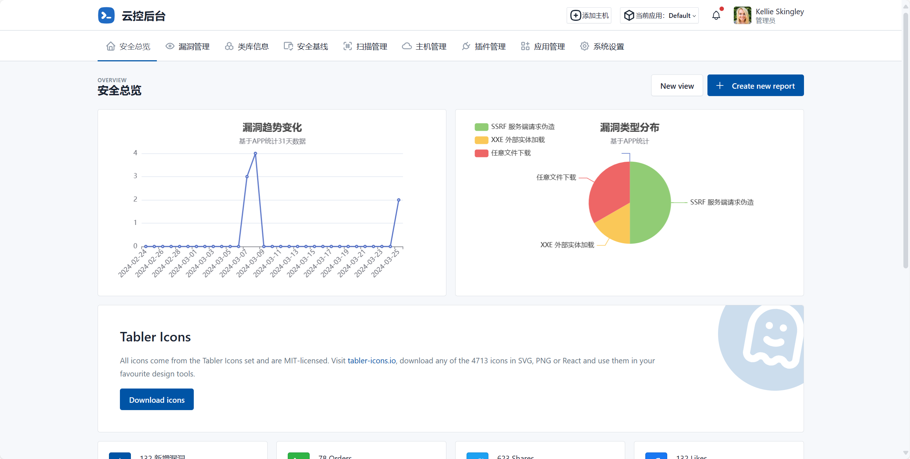
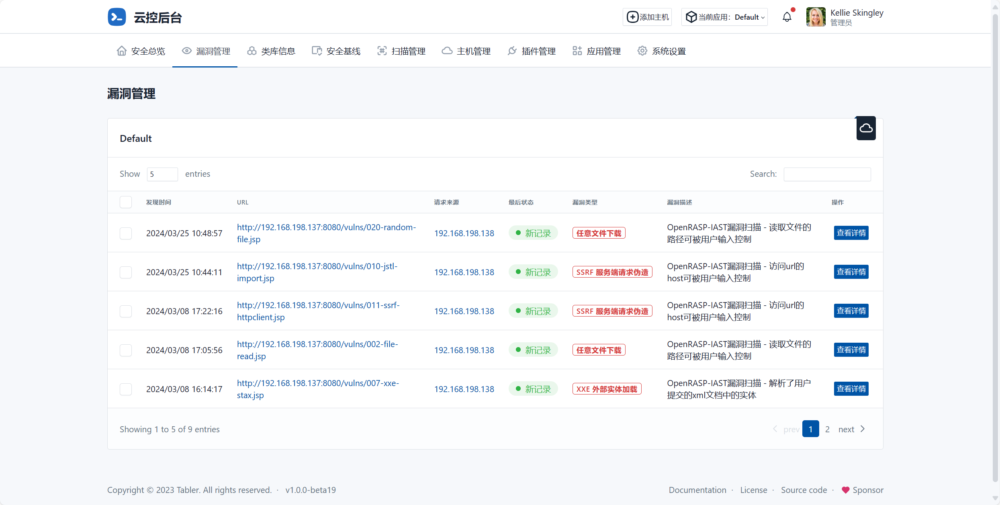
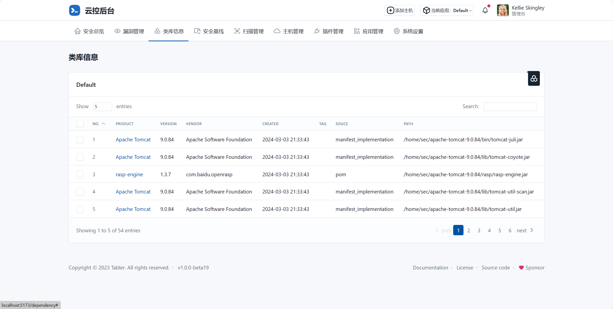
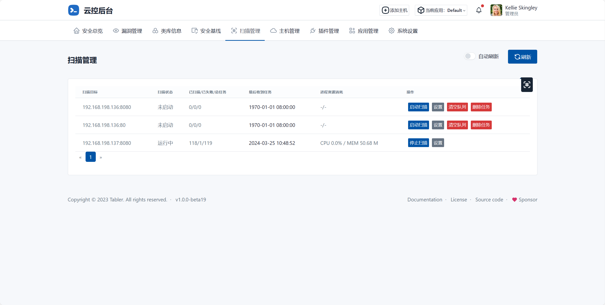
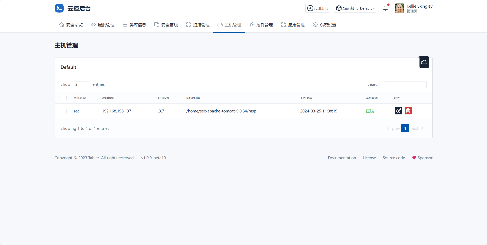
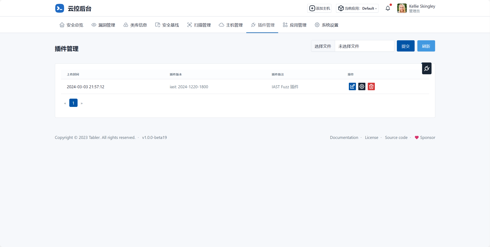
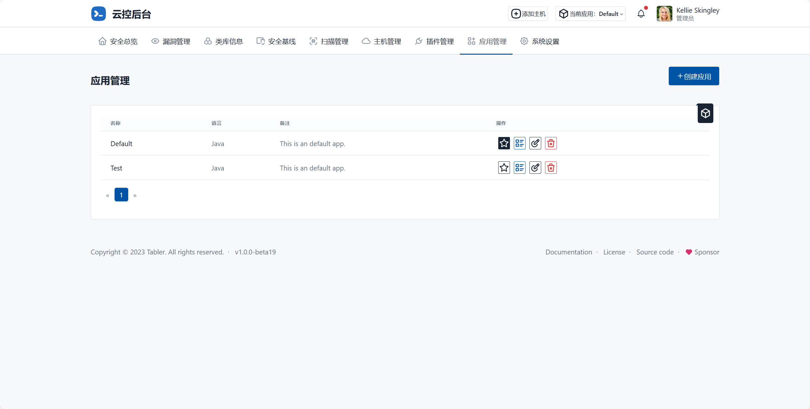
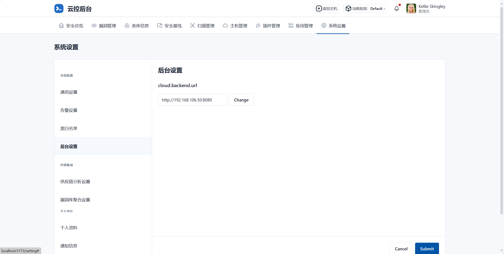

# iast-controller

## 目录结构

```bash
.
├── doc
│   ├── alert
│   ├── demo
│   └── images
├── iast-vue
│   ├── public
│   └── src
│       ├── assets
│       │   └── avatars
│       ├── components
│       │   ├── modals
│       │   ├── pages
│       │   │   ├── charts
│       │   │   └── settings
│       │   └── utils
│       ├── router
│       ├── stores
│       ├── util
│       └── views
│           └── layout
├── icloud
│   ├── agent
│   │   ├── migrations
│   │   ├── routers
│   │   └── util
│   ├── controller
│   │   ├── migrations
│   │   ├── routers
│   │   ├── services
│   │   └── util
│   ├── iast
│   │   ├── migrations
│   │   ├── routers
│   │   ├── services
│   │   └── ws
│   └── icloud
└── plugins
```

## 截图

#### 安全总览



#### 漏洞管理



#### 类库信息



#### 扫描管理



#### 主机管理



#### 插件管理



#### 应用管理



#### 系统设置


